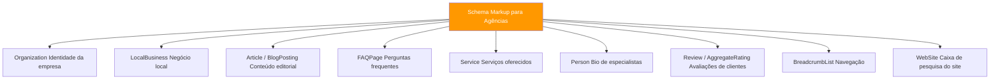

# Schema Markup — Tipos e Implementação

> [!abstract] **Referência prática**
> Este ficheiro contém os schemas mais importantes para agências digitais, com exemplos de código prontos a usar.

---

## Os Schemas Mais Importantes para Agências



---

## 1. Organization

Identifica a empresa como entidade no Knowledge Graph. **Essencial para GEO.**

```json
{
  "@context": "https://schema.org",
  "@type": "Organization",
  "name": "Agência Exemplo",
  "legalName": "Agência Exemplo, Lda.",
  "url": "https://agencia.pt",
  "logo": {
    "@type": "ImageObject",
    "url": "https://agencia.pt/logo.png",
    "width": 300,
    "height": 100
  },
  "description": "Agência especializada em SEO técnico, GEO e marketing digital para PMEs em Portugal.",
  "foundingDate": "2015",
  "founders": [{
    "@type": "Person",
    "name": "Nome do Fundador"
  }],
  "address": {
    "@type": "PostalAddress",
    "streetAddress": "Rua Exemplo, 123",
    "addressLocality": "Lisboa",
    "postalCode": "1000-001",
    "addressCountry": "PT"
  },
  "contactPoint": {
    "@type": "ContactPoint",
    "telephone": "+351-21-000-0000",
    "contactType": "customer service",
    "availableLanguage": "Portuguese"
  },
  "sameAs": [
    "https://www.linkedin.com/company/agencia-exemplo",
    "https://twitter.com/agencia_exemplo",
    "https://www.facebook.com/agencia.exemplo",
    "https://www.instagram.com/agencia_exemplo"
  ]
}
```

---

## 2. LocalBusiness

Para negócios com localização física ou serviço local. Alimenta o **Google Maps e o Knowledge Panel local.**

```json
{
  "@context": "https://schema.org",
  "@type": "LocalBusiness",
  "name": "Agência Exemplo",
  "image": "https://agencia.pt/foto-escritorio.jpg",
  "url": "https://agencia.pt",
  "telephone": "+351-21-000-0000",
  "email": "info@agencia.pt",
  "priceRange": "€€",
  "address": {
    "@type": "PostalAddress",
    "streetAddress": "Rua Exemplo, 123",
    "addressLocality": "Lisboa",
    "postalCode": "1000-001",
    "addressCountry": "PT"
  },
  "geo": {
    "@type": "GeoCoordinates",
    "latitude": 38.7223,
    "longitude": -9.1393
  },
  "openingHoursSpecification": [{
    "@type": "OpeningHoursSpecification",
    "dayOfWeek": ["Monday", "Tuesday", "Wednesday", "Thursday", "Friday"],
    "opens": "09:00",
    "closes": "18:00"
  }],
  "aggregateRating": {
    "@type": "AggregateRating",
    "ratingValue": "4.8",
    "reviewCount": "47"
  }
}
```

---

## 3. Article / BlogPosting

Para artigos e posts do blog. **Crítico para AIO** — a IA identifica o autor, data e tipo de conteúdo.

```json
{
  "@context": "https://schema.org",
  "@type": "BlogPosting",
  "headline": "Guia Completo de SEO Técnico para 2026",
  "description": "Tudo o que precisa de saber sobre SEO técnico, desde rastreamento até Core Web Vitals.",
  "image": "https://agencia.pt/blog/seo-tecnico-guia.jpg",
  "author": {
    "@type": "Person",
    "name": "Nome do Autor",
    "url": "https://agencia.pt/equipa/nome-autor",
    "jobTitle": "SEO Specialist",
    "worksFor": {
      "@type": "Organization",
      "name": "Agência Exemplo"
    }
  },
  "publisher": {
    "@type": "Organization",
    "name": "Agência Exemplo",
    "logo": {
      "@type": "ImageObject",
      "url": "https://agencia.pt/logo.png"
    }
  },
  "datePublished": "2026-06-09",
  "dateModified": "2026-06-09",
  "mainEntityOfPage": {
    "@type": "WebPage",
    "@id": "https://agencia.pt/blog/seo-tecnico-guia"
  }
}
```

---

## 4. FAQPage

Para páginas com perguntas e respostas. **Gera acordeão na SERP e é excelente para AIO** (IA extrai diretamente).

```json
{
  "@context": "https://schema.org",
  "@type": "FAQPage",
  "mainEntity": [
    {
      "@type": "Question",
      "name": "O que é SEO técnico?",
      "acceptedAnswer": {
        "@type": "Answer",
        "text": "SEO técnico é o conjunto de otimizações estruturais de um website que permitem aos motores de pesquisa rastrear, indexar e interpretar o conteúdo sem barreiras."
      }
    },
    {
      "@type": "Question",
      "name": "Quanto tempo demora a ver resultados de SEO?",
      "acceptedAnswer": {
        "@type": "Answer",
        "text": "Os resultados de SEO demoram tipicamente entre 3 a 6 meses para conteúdo novo, podendo ser mais rápidos em sites com autoridade estabelecida."
      }
    }
  ]
}
```

---

## 5. Person — Bio de Especialistas

**Crítico para E-E-A-T e GEO.** Identifica autores como especialistas reconhecíveis.

```json
{
  "@context": "https://schema.org",
  "@type": "Person",
  "name": "Nome do Especialista",
  "jobTitle": "SEO Strategy Lead",
  "worksFor": {
    "@type": "Organization",
    "name": "Agência Exemplo"
  },
  "url": "https://agencia.pt/equipa/nome-especialista",
  "image": "https://agencia.pt/equipa/foto-nome.jpg",
  "description": "Especialista em SEO técnico e GEO com 10 anos de experiência em otimização para motores de pesquisa.",
  "sameAs": [
    "https://www.linkedin.com/in/nome-especialista",
    "https://twitter.com/nome_especialista"
  ],
  "knowsAbout": ["SEO", "GEO", "Marketing Digital", "Core Web Vitals"]
}
```

---

## 6. Service — Serviços Oferecidos

```json
{
  "@context": "https://schema.org",
  "@type": "Service",
  "name": "Consultoria de SEO Técnico",
  "description": "Auditoria completa e otimização técnica de SEO para sites WordPress, e-commerce e aplicações web.",
  "provider": {
    "@type": "Organization",
    "name": "Agência Exemplo"
  },
  "areaServed": {
    "@type": "Country",
    "name": "Portugal"
  },
  "serviceType": "SEO",
  "offers": {
    "@type": "Offer",
    "description": "Auditoria SEO técnica completa",
    "priceSpecification": {
      "@type": "PriceSpecification",
      "priceCurrency": "EUR"
    }
  }
}
```

---

## 7. BreadcrumbList

Gera breadcrumb visual na SERP e ajuda a IA a entender a hierarquia do site.

```json
{
  "@context": "https://schema.org",
  "@type": "BreadcrumbList",
  "itemListElement": [
    {
      "@type": "ListItem",
      "position": 1,
      "name": "Home",
      "item": "https://agencia.pt"
    },
    {
      "@type": "ListItem",
      "position": 2,
      "name": "Blog",
      "item": "https://agencia.pt/blog"
    },
    {
      "@type": "ListItem",
      "position": 3,
      "name": "SEO",
      "item": "https://agencia.pt/blog/seo"
    },
    {
      "@type": "ListItem",
      "position": 4,
      "name": "SEO Técnico: Guia Completo",
      "item": "https://agencia.pt/blog/seo/seo-tecnico-guia"
    }
  ]
}
```

---

## Combinar Múltiplos Schemas

É possível (e recomendado) ter múltiplos schemas numa página:

```html
<head>
  <!-- Schema da Organização (todas as páginas) -->
  <script type="application/ld+json">
    { "@context": "https://schema.org", "@type": "Organization", ... }
  </script>
  
  <!-- Schema do Artigo (só em artigos) -->
  <script type="application/ld+json">
    { "@context": "https://schema.org", "@type": "BlogPosting", ... }
  </script>
  
  <!-- Schema do Breadcrumb (todas exceto homepage) -->
  <script type="application/ld+json">
    { "@context": "https://schema.org", "@type": "BreadcrumbList", ... }
  </script>
  
  <!-- Schema FAQ (só em páginas com FAQ) -->
  <script type="application/ld+json">
    { "@context": "https://schema.org", "@type": "FAQPage", ... }
  </script>
</head>
```

---

## Tabela de Schemas por Tipo de Página

| Tipo de Página | Schemas Recomendados |
|---------------|---------------------|
| Homepage | Organization, WebSite |
| Sobre Nós | Organization, Person (equipa) |
| Serviço/Produto | Service/Product, BreadcrumbList |
| Artigo/Blog | BlogPosting, BreadcrumbList, FAQPage |
| FAQ | FAQPage |
| Contacto | LocalBusiness, ContactPage |
| Caso de Estudo | Article, Review |
| E-commerce produto | Product, Offer, AggregateRating |

---

## Checklist de Implementação

- [ ] Organization em todas as páginas (via layout global)
- [ ] BreadcrumbList em todas as páginas exceto homepage
- [ ] BlogPosting/Article em cada artigo
- [ ] FAQPage em páginas com perguntas frequentes
- [ ] Person nas páginas de autor e equipa
- [ ] Service/Product nas páginas de oferta
- [ ] LocalBusiness se negócio local
- [ ] Validado no Google Rich Results Test
- [ ] Sem erros no Google Search Console (Rich Results)

---

## Ver também

- [[Dados Estruturados - Overview]] — conceitos base
- [[../03 - AIO/Otimização On-Page para IA|Otimização On-Page para IA]] — como schema ajuda o AIO
- [[../04 - GEO/EEAT e Autoridade|EEAT e Autoridade]] — schema Person e Organization para E-E-A-T
