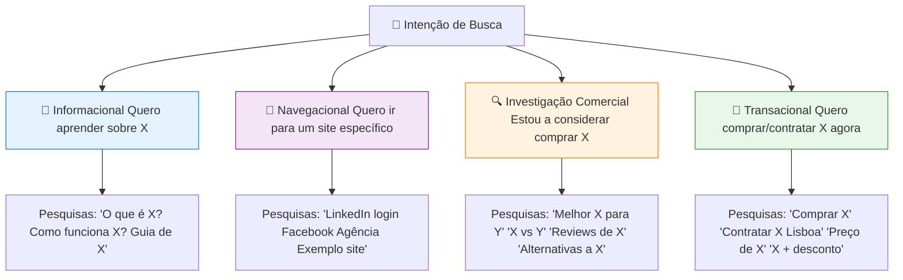
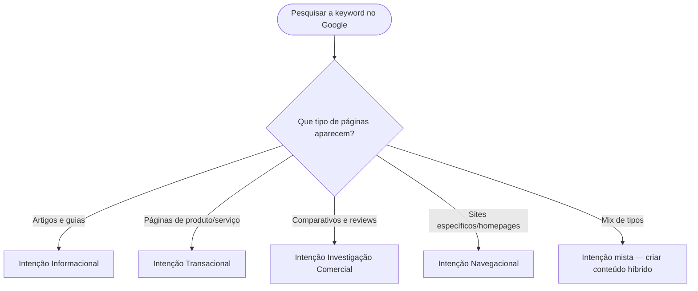
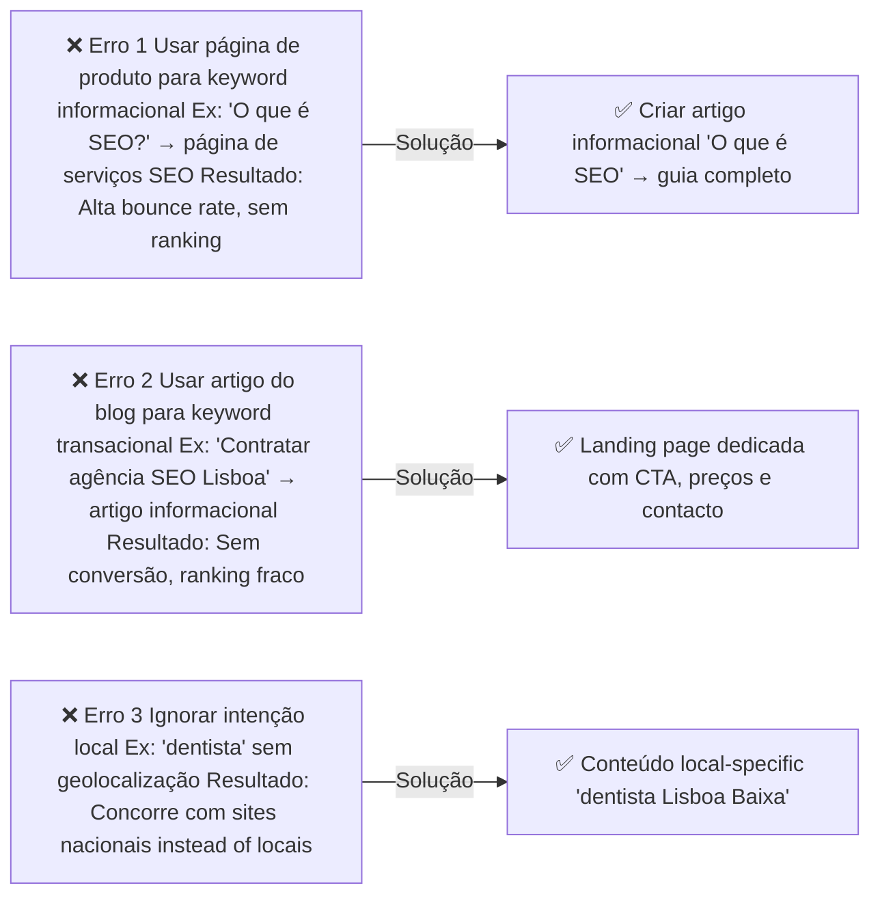
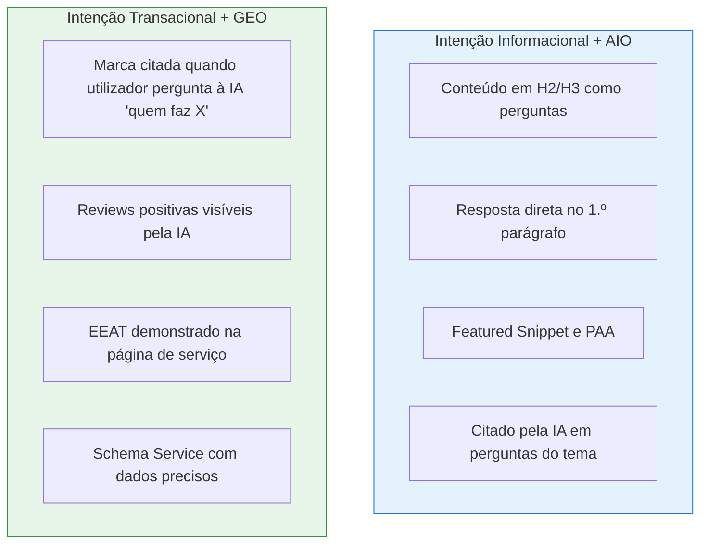

# Intenção de Busca

> [!abstract] **A chave do SEO moderno**
> O Google não rankeia apenas o conteúdo mais relevante — rankeia o conteúdo que melhor satisfaz a **intenção** do utilizador. Criar conteúdo desalinhado com a intenção é um dos erros mais comuns e mais prejudiciais.

---

## Os 4 Tipos de Intenção



---

## Tipo de Conteúdo por Intenção

| Intenção | Tipo de Conteúdo | Objetivo | Métricas |
|----------|-----------------|---------|---------|
| **Informacional** | Artigos, guias, tutoriais, vídeos | Educar | Tempo na página, partilhas |
| **Navegacional** | Homepage, landing pages de marca | Converter visitantes diretos | CTR, bounce rate |
| **Investigação Comercial** | Comparativos, reviews, case studies, pricing | Avançar no funil | Tempo, conversão micro |
| **Transacional** | Páginas de produto/serviço, landing pages | Converter | Conversão, receita |

---

## Como Identificar a Intenção

### Método 1: Analisar os Top 10 Resultados



### Método 2: Analisar o Featured Snippet

| Featured Snippet | Intenção provável |
|-----------------|------------------|
| Definição/explicação | Informacional |
| Lista de passos | Informacional (how-to) |
| Lista de produtos | Investigação comercial |
| Preços ou comparação | Investigação comercial / Transacional |
| Endereço ou horário | Transacional local |

---

## Erros de Intenção — Os Mais Comuns



---

## Intenção Informacional — Como Otimizar

### Estrutura ideal de artigo informacional

```
H1: [Keyword principal] — [Proposta de valor]
↓
Parágrafo de abertura: resposta direta em 2-3 frases
↓
H2: O que é [tema]? (definição)
H2: Como funciona [tema]? (processo)
H2: Por que [tema] é importante? (benefícios)
H2: Como implementar [tema]? (passos práticos)
H2: Exemplos de [tema] (casos reais)
H2: Perguntas frequentes sobre [tema] (FAQ Schema)
↓
Conclusão com CTA suave (leitura adicional ou subscrição)
```

---

## Intenção Transacional — Como Otimizar

### Estrutura ideal de página de serviço/produto

```
H1: [Serviço] para [Tipo de Cliente] em [Localização]
↓
Value proposition clara em 2 frases
↓
CTA primário (botão "Pedir proposta" / "Contactar")
↓
H2: O que inclui [Serviço]? (lista de entregáveis)
H2: Como funciona o processo? (passos)
H2: Resultados que os nossos clientes obtêm (prova social)
H2: Quanto custa [Serviço]? (pricing ou range)
H2: Perguntas frequentes
↓
CTA final + formulário de contacto
```

---

## Intenção de Investigação Comercial

### Tipos de conteúdo mais eficazes

| Formato | Exemplo | Quando usar |
|---------|---------|-------------|
| **Comparativo** | "Ahrefs vs SEMrush: qual escolher em 2026?" | Utilizador avalia alternativas |
| **Review** | "Review: Ferramenta X — vale a pena?" | Utilizador quer validação |
| **Best-of** | "10 melhores ferramentas de SEO para PMEs" | Utilizador quer opções curadas |
| **Case study** | "Como aumentámos o tráfego orgânico 300% em 6 meses" | Prova de resultados |
| **Guia de compra** | "Como escolher uma agência de SEO" | Guiar a decisão |

---

## Intenção e AIO/GEO



---

## Checklist de Alinhamento de Intenção

Para cada página do site:
- [ ] A intenção da keyword foi identificada
- [ ] O tipo de conteúdo corresponde à intenção
- [ ] O formato (artigo vs landing page vs lista) está correto
- [ ] O CTA está alinhado com a fase do funil
- [ ] O conteúdo responde completamente à questão do utilizador
- [ ] A página foi testada com pesquisa no Google (verificar top 10)

---

## Ver também

- [[Tipos de Busca e SERP]] — formatos de resultado SERP
- [[../02 - SEO/Conteúdo e Taxonomia|Conteúdo e Taxonomia]] — estratégia de conteúdo
- [[../03 - AIO/Otimização On-Page para IA|Otimização On-Page para IA]] — estrutura para AIO
