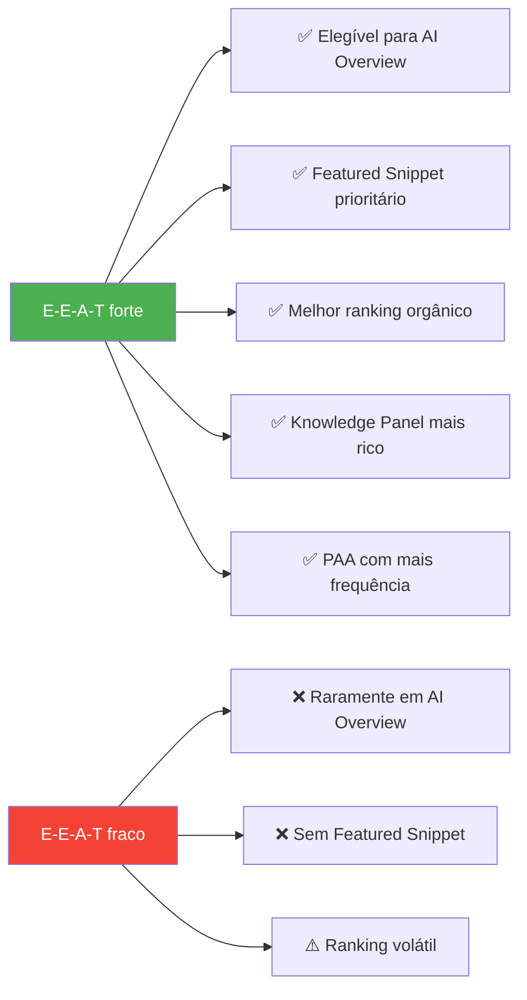
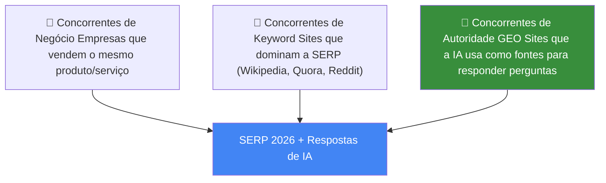

# Tipos de Busca e SERP

> [!abstract] **A SERP (Search Engine Results Page) hoje**
> A página de resultados do Google transformou-se radicalmente. Já não é apenas uma lista de 10 links — é um ecossistema de diferentes formatos de resultado, cada um com a sua lógica de aparência e critérios de otimização.

---

## Mapa da SERP Moderna

```mermaid
graph TD
    SERP["🔍 SERP - Página de Resultados"] 

    SERP --> AI["🤖 AI Overview (Google SGE)\nResposta gerada por IA no topo"]
    SERP --> FEATURED["⭐ Featured Snippet (Posição Zero) Caixa de resposta direta"]
    SERP --> ADS["💰 Google Ads Resultados patrocinados"]
    SERP --> LOCAL["📍 Local Pack 3 resultados locais com mapa"]
    SERP --> PAA["❓ People Also Ask FAQ acordeão"]
    SERP --> ORGANIC["📄 Resultados Orgânicos 10 links clássicos"]
    SERP --> IMAGES["🖼️ Carrossel de Imagens Resultados visuais"]
    SERP --> VIDEO["▶️ Carrossel de Vídeo YouTube e outros"]
    SERP --> NEWS["📰 Top Stories Notícias recentes"]
    SERP --> KNOWLEDGE["🧠 Knowledge Panel Infobox lateral de entidade"]
    SERP --> SHOPPING["🛍️ Shopping Listagem de produtos e preços"]

    style SERP fill:#4285F4,color:white
    style AI fill:#34A853,color:white
    style FEATURED fill:#FBBC05,color:black
    style LOCAL fill:#EA4335,color:white
```



---

## Descrição de Cada Tipo de Resultado

### 1. AI Overview (Google SGE)
**O que é:** Resposta gerada por IA no topo da SERP, antes de qualquer resultado orgânico.

**Como aparecer:**
- SEO forte nas top 3 posições para o tema
- E-E-A-T elevado
- Dados estruturados corretos
- Conteúdo que responde diretamente à pergunta

> [!warning] **O maior impacto de tráfego**
> O AI Overview reduz drasticamente cliques para resultados orgânicos. Ser citado **dentro** do AI Overview é o novo "posição 1".

---

### 2. Featured Snippet (Posição Zero)
**O que é:** Caixa destacada que aparece antes dos resultados orgânicos com resposta direta.

**Tipos:**
| Tipo | Como otimizar |
|------|--------------|
| **Parágrafo** | Resposta de 40-60 palavras após H2 com pergunta |
| **Lista ordenada** | Passos numerados (1, 2, 3...) |
| **Lista não-ordenada** | Bullet points com características |
| **Tabela** | Tabela Markdown para comparações |

---

### 3. Knowledge Panel
**O que é:** Painel lateral com informação sobre uma entidade (empresa, pessoa, local, produto).

**Como aparecer:**
- Schema Organization ou Person implementado
- Google My Business verificado (para empresas locais)
- Presença em Wikipedia/Wikidata
- Múltiplas menções externas da entidade

---

### 4. Local Pack (3-Pack)
**O que é:** 3 resultados de negócios locais com mapa, estrelas e distância.

**Como aparecer:**
- Google My Business completo e verificado
- Reviews positivas e recentes
- Citações NAP (Name, Address, Phone) consistentes
- Schema LocalBusiness implementado
- Proximidade do utilizador (fator dominante)

---

### 5. People Also Ask (PAA)
**O que é:** Acordeão de perguntas relacionadas com respostas expandíveis.

**Como aparecer:**
- Ter H2/H3 formulados como perguntas
- Resposta direta e concisa (2-4 frases) após cada pergunta
- Schema FAQPage implementado
- Conteúdo alinhado com as perguntas reais dos utilizadores

---

### 6. Resultados Orgânicos Clássicos
**O que é:** Os 10 links tradicionais com título, URL e meta description.

**Como otimizar:**
- Title tag atrativa com keyword
- Meta description com CTA
- URL limpa e descritiva
- Velocidade e Core Web Vitals
- Relevância e autoridade do conteúdo

---

### 7. Carrosseis (Imagens e Vídeo)
**O que é:** Resultados visuais que aparecem para pesquisas com intenção visual.

| Tipo | Como aparecer |
|------|-------------|
| **Imagens** | Alt text descritivo, nome do ficheiro, schema ImageObject |
| **Vídeo** | YouTube otimizado, schema VideoObject, thumbnails de qualidade |
| **Produtos** | Schema Product + Google Merchant Center |

---

## EEAT na SERP

### Como o E-E-A-T afeta cada tipo de resultado



### Comparação EEAT entre Google e LLM

| | **Google** | **LLM** |
|---|---|---|
| **Foco Principal** | Reconhecimento de páginas especializadas | Citações, menções, recomendações do conteúdo |
| **Experiência** | Sinal indireto através de conteúdo aprofundado e avaliações | Crucial — modelos valorizam conteúdos com experiências reais |
| **Especialização** | Demonstra por credenciais e profundidade do conteúdo | Avaliada pela consistência e precisão das informações ao longo do tempo |
| **Autoridade** | Backlinks e menções de outros sites de alta qualidade | Frequência e contexto em que o conteúdo é usado como fonte confiável |
| **Confiança** | Segurança do site, transparência e histórico de precisão | Precisão factual e ausência de viés são fundamentais para ser citado |

---

## Tipos de Concorrência na SERP

### Antes (SEO clássico)
```
Posição 1: Empresa A → goal: chegar aqui
Posição 2: Empresa B
...
```

### Agora (Era GEO + IA)



> [!important] **As LLMs criam um novo tipo de concorrência**
> A concorrência deixou de ser apenas sobre o ranking de links. Envolve a **confiança que a IA deposita** em cada fonte. Uma empresa pode não rankear bem no Google mas ser consistentemente citada pelas IAs.

---

## Como as LLMs Escolhem o Conteúdo

### Análise na SERP
- Termos relevantes e análise de intenções de pesquisa
- Identificação de concorrentes diretos
- Profundidade e qualidade dos primeiros resultados

### Resposta LLM
- Análise das citações externas
- Estrutura aprofundada das respostas
- Precisão semântica e confiabilidade da fonte
- Consistência histórica do conteúdo

---

## Checklist SERP — Presença em Todos os Formatos

| Formato | Acções necessárias |
|---------|-------------------|
| **AI Overview** | SEO forte + E-E-A-T elevado + dados estruturados |
| **Featured Snippet** | H2/H3 como perguntas + resposta direta |
| **Knowledge Panel** | Schema Organization + Google My Business |
| **Local Pack** | GMB verificado + reviews + NAP consistente |
| **PAA** | Schema FAQPage + conteúdo em Q&A |
| **Orgânico** | On-page + off-page + técnico |
| **Imagens** | Alt text + schema ImageObject + WebP |
| **Vídeo** | YouTube otimizado + schema VideoObject |

---

## Ver também

- [[Intenção de Busca]] — tipos de intenção e como otimizar
- [[../04 - GEO/EEAT e Autoridade|EEAT e Autoridade]] — como construir confiança
- [[../05 - Dados Estruturados/Schema Markup - Tipos e Implementação|Schema Markup]] — implementação técnica
- [[../03 - AIO/Otimização On-Page para IA|Otimização On-Page para IA]] — featured snippets e PAA
