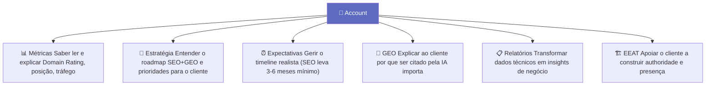
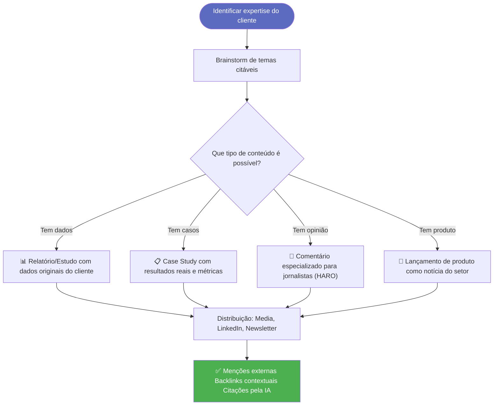
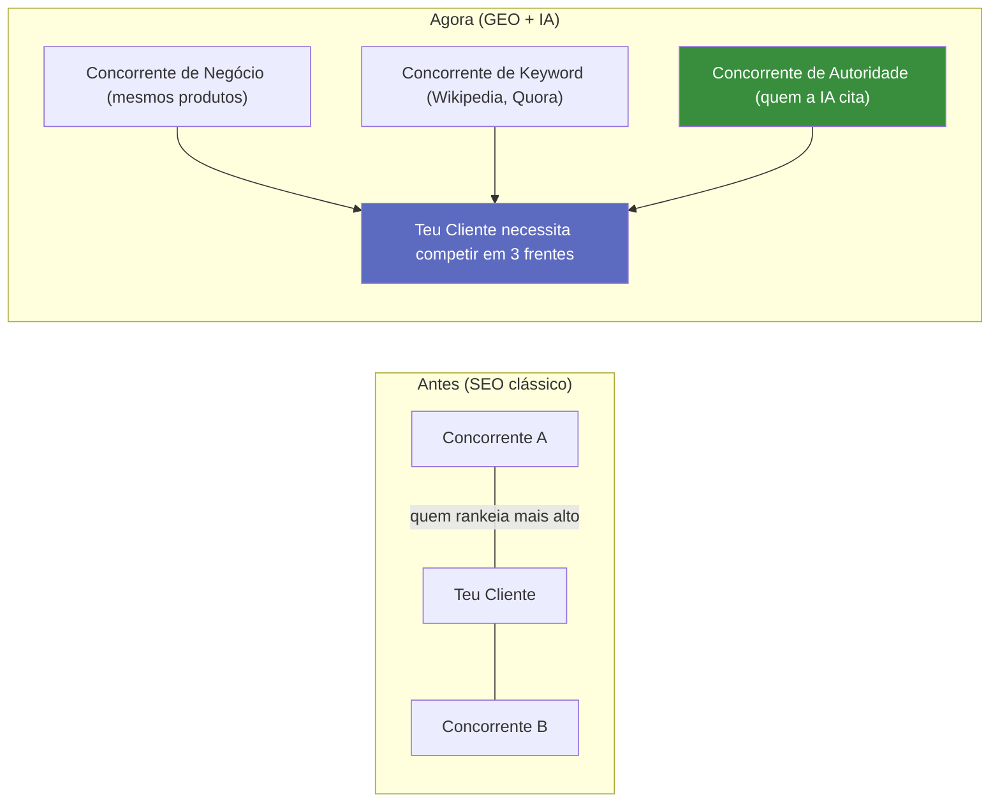

# Guia para Accounts

> [!abstract] **O papel do Account no SEO/GEO**
> O account é o elo entre a estratégia e o cliente. Precisa de entender o suficiente para traduzir resultados técnicos em valor de negócio, gerir expectativas realistas e ajudar a construir a autoridade da marca do cliente.

---

## O que o Account deve dominar



---

## Gerir Expectativas de Tempo

> [!warning] **Conversa crucial com o cliente — desde o primeiro dia**
> SEO e GEO **não são instantâneos**. Gerir expectativas de tempo é responsabilidade do account e previne conflitos futuros.

### Timeline realista por ação

| Ação | Quando ver resultados |
|------|--------------------|
| Correções técnicas SEO | 1-4 semanas (indexação) |
| Publicação de novo conteúdo | 2-6 meses (ranking) |
| Link building | 3-6 meses (impacto em DA) |
| GEO — presença nas IAs | 6-12 meses |
| GEO — ser citado regularmente | 12-18 meses |
| SEO local | 1-3 meses |
| E-commerce SEO | 3-9 meses |

---

## Métricas para Reportar ao Cliente

### O que reportar (e o que evitar)

| ✅ Reportar | ❌ Evitar (sem contexto) |
|------------|------------------------|
| Tráfego orgânico | Número de keywords |
| Posição média no GSC | PageRank (desatualizado) |
| Impressões e CTR | DA/DR (métricas de terceiros sem contexto) |
| Conversões do orgânico | Volume de backlinks sem qualidade |
| Citation share nas IAs | "Estamos a trabalhar" sem números |
| Domain Rating (tendência) | Posições de keywords isoladas sem tráfego |

### Dashboard mensal para o cliente

```
📊 RELATÓRIO SEO/GEO — [Mês] [Ano]

SUMÁRIO EXECUTIVO
━━━━━━━━━━━━━━━━━━
✅ Tráfego orgânico: +X% vs mês anterior
✅ Posição média: X (era X no mês anterior)
📍 Conversões do orgânico: X (meta: Y)
🤖 Presença nas IAs: mencionado em X% das perguntas testadas

AÇÕES REALIZADAS ESTE MÊS
━━━━━━━━━━━━━━━━━━
• [Ação 1] → [Resultado]
• [Ação 2] → [Resultado esperado em X semanas]

PRÓXIMOS PASSOS
━━━━━━━━━━━━━━━━━━
1. [Ação prioritária]
2. [Conteúdo a publicar]
3. [Oportunidade identificada]
```

---

## Explicar GEO ao Cliente

### A analogia que funciona

> [!example] **Analogia para clientes**
>
> "Imagina que antes do Google ser inventado, as pessoas encontravam serviços através de recomendações. Alguém perguntava a um amigo 'conheces um bom advogado?' e esse amigo recomendava.
>
> Hoje, quando alguém pergunta ao ChatGPT 'qual a melhor agência de marketing digital?', o ChatGPT faz exatamente isso — recomenda as marcas em que confia.
>
> O GEO é a estratégia para garantir que a tua marca é uma das que o ChatGPT recomenda."

### Os 3 pilares em linguagem de cliente

| Pilar técnico | Como explicar ao cliente |
|---------------|-------------------------|
| **Presença** | "Quantos sites relevantes falam de ti — media, diretórios, artigos?" |
| **Profundidade** | "Quando tens dados ou estudos originais, as IAs citam-te como fonte" |
| **Posicionamento** | "A IA precisa de saber claramente o que fazes — a tua especialidade deve ser óbvia" |

---

## Construir EEAT com o Cliente

O account é quem tem o relacionamento para extrair informação do cliente que fortalece o E-E-A-T.

### Perguntas a fazer ao cliente para EEAT

| Dimensão | Perguntas ao cliente |
|----------|---------------------|
| **Experiência** | "Tens casos de estudo com resultados reais? Podes partilhar dados?" |
| **Especialização** | "Qual a formação/certificações da equipa? Há prémios ou reconhecimentos?" |
| **Autoridade** | "Já foste entrevistado? Já saíste na media? Tens testemunhos de clientes?" |
| **Confiança** | "O site tem certificado SSL? Política de privacidade atualizada? Reviews no Google?" |

---

## Estratégia de Digital PR com o Cliente



---

## Tipos de Concorrência — Explicar ao Cliente



---

## Checklist do Account — Onboarding de Cliente

### Auditoria inicial
- [ ] Verificar Google Search Console (pedir acesso)
- [ ] Verificar Google My Business (pedir acesso)
- [ ] Verificar perfil de backlinks (Ahrefs/SEMrush)
- [ ] Testar presença nas IAs (ChatGPT, Gemini, Perplexity)
- [ ] Identificar concorrentes de autoridade

### Construção de autoridade
- [ ] Schema Organization implementado
- [ ] Página "Sobre Nós" robusta criada/melhorada
- [ ] Bio de especialistas adicionada
- [ ] Google My Business otimizado
- [ ] Primeiros guest posts / digital PR planeados

### Relatórios mensais
- [ ] Dashboard de métricas SEO configurado
- [ ] Teste de presença nas IAs documentado
- [ ] Resultados em linguagem de negócio
- [ ] Próximas ações claramente definidas

---

## Ver também

- [[../04 - GEO/GEO - Overview|GEO - Overview]] — o conceito em profundidade
- [[../04 - GEO/EEAT e Autoridade|EEAT e Autoridade]] — construir confiança
- [[../04 - GEO/Como Medir o GEO|Como Medir o GEO]] — métricas para reportar
- [[../04 - GEO/3 Pilares Fundamentais do GEO|3 Pilares Fundamentais]] — roadmap GEO
