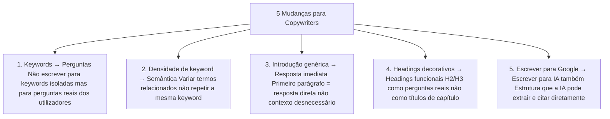

# Guia para Copywriters

> [!abstract] **O que mudou para os copywriters**
> Escrever para SEO em 2026 significa escrever para **três audiências em simultâneo**: o utilizador humano, o algoritmo do Google e os modelos de IA generativa. A boa notícia: as boas práticas convergem — conteúdo claro, estruturado e útil funciona para todos.

---

## As 5 Mudanças Fundamentais



---

## A Nova Fórmula de Escrita SEO/AIO

### Estrutura do Artigo Ideal

```
1. TÍTULO (H1)
   └── Keyword principal + proposta de valor
   └── Exemplo: "SEO Técnico: O Guia Completo para 2026"

2. PARÁGRAFO DE ABERTURA
   └── Resposta direta em 2-3 frases (não mais)
   └── O utilizador deve entender o essencial sem ler mais

3. SECÇÕES (H2)
   └── Formulados como perguntas: "Como funciona X?"
   └── Primeiro parágrafo da secção = resposta direta
   └── Depois: contexto, explicação, exemplos

4. SUBSECÇÕES (H3)
   └── Sub-perguntas: "Quais os erros mais comuns em X?"
   └── Listas, tabelas e comparações

5. ELEMENTOS VISUAIS DE CONTEÚDO
   └── Tabelas comparativas
   └── Listas numeradas (processos/passos)
   └── Listas de bullets (características/opções)

6. CONCLUSÃO
   └── Resumo dos pontos principais
   └── CTA claro e relevante
```

---

## Escrever para Featured Snippets

### Parágrafo (mais comum)

```
H2: O que é SEO técnico?

SEO técnico é o conjunto de otimizações estruturais de um website que 
permitem aos motores de pesquisa rastrear, indexar e interpretar o conteúdo 
sem barreiras. É a fundação sobre a qual qualquer estratégia de SEO assenta.
[40-60 palavras — ideal para featured snippet]
```

### Lista (para processos)

```
H2: Como fazer uma auditoria SEO em 5 passos?

1. Verifica erros de rastreamento no Google Search Console
2. Analisa a cobertura de indexação (páginas indexadas vs. excluídas)
3. Avalia o perfil de backlinks com Ahrefs ou SEMrush
4. Testa a velocidade com PageSpeed Insights
5. Audita o conteúdo on-page (titles, metas, H1, duplicados)
[Lista numerada clara — aparece como featured snippet de lista]
```

### Tabela (para comparações)

```
H2: Qual a diferença entre SEO, AIO e GEO?

| Característica | SEO | AIO | GEO |
|---------------|-----|-----|-----|
| Motor alvo | Google | LLMs on-page | IAs generativas |
| Objetivo | Rankear | Ser compreendido | Ser citado |
[Tabela — aparece como featured snippet de tabela]
```

---

## As 5 Perguntas a Responder em Cada Artigo

Para garantir que o conteúdo é AIO-friendly, cada artigo deve responder:

| Pergunta | Tipo de heading | Exemplo |
|---------|-----------------|---------|
| **O quê?** | H2 | "O que é [tema]?" |
| **Porquê?** | H2 | "Por que [tema] é importante?" |
| **Como?** | H2 | "Como implementar [tema]?" |
| **Quando?** | H3 | "Quando devo usar [tema]?" |
| **Quem?** | H3 | "Para quem é indicado [tema]?" |

---

## Tom e Linguagem

### Para SEO + AIO

- **Tom:** Conversacional mas autoritativo
- **Frases:** Médias (15-25 palavras) — nem muito curtas, nem muito longas
- **Voz:** Ativa, não passiva ("O Google prioriza..." não "É priorizado pelo Google...")
- **Evitar:** Jargão sem explicação, frases ambíguas, opiniões sem fundamento

### Para GEO — construir autoridade no texto

```
❌ Genérico (sem autoridade):
"O SEO é importante para as empresas."

✅ Com autoridade (citável pela IA):
"Segundo a nossa análise de 500 sites PME em Portugal em 2025, 
73% tinha pelo menos um problema crítico de rastreamento que 
reduzia a visibilidade orgânica em mais de 40%."
```

---

## Usar Keywords Naturalmente

### Densidade de keyword — obsoleto em 2026

> [!warning] **A "densidade de keyword" é um conceito ultrapassado**
> Repetir uma keyword 15 vezes num artigo de 1000 palavras **não ajuda** e pode prejudicar. O Google e as IAs entendem semântica e sinónimos.

### O que fazer em vez disso

| Ao invés de... | Fazer isto... |
|---------------|--------------|
| Repetir "SEO técnico" 20x | Usar "otimização técnica", "rastreamento", "indexação", "performance" |
| "Agência de SEO" por toda a parte | Variar com "especialistas em otimização", "consultores de SEO" |
| Forçar keywords | Escrever naturalmente e as keywords surgem organicamente |

---

## Checklist do Copywriter

### Antes de escrever
- [ ] Intenção de pesquisa identificada
- [ ] Top 10 resultados do Google analisados
- [ ] Perguntas do PAA levantadas
- [ ] Estrutura de headings planeada

### Durante a escrita
- [ ] Primeiro parágrafo responde diretamente
- [ ] H2 e H3 formulados como perguntas
- [ ] Linguagem natural e conversacional
- [ ] Pelo menos 1 tabela ou lista por secção principal
- [ ] Experiência real ou dados incluídos
- [ ] Fontes citadas quando relevante

### Após a escrita
- [ ] Meta description escrita (150-160 caracteres)
- [ ] Alt text das imagens preenchido
- [ ] Links internos para artigos relacionados
- [ ] Schema FAQ adicionado se há perguntas/respostas
- [ ] Revisão para precisão factual

---

## Exemplos de Escrita — Antes e Depois

### Abertura de artigo

**❌ Antes:**
> "Neste artigo vamos falar sobre o SEO técnico. O SEO é muito importante para as empresas que querem ter presença online. Vamos ver o que é o SEO técnico e como pode ajudar o teu site."

**✅ Depois (AIO-friendly):**
> "SEO técnico é o conjunto de otimizações que permite ao Google rastrear e indexar o teu site sem barreiras. Sem isso, o melhor conteúdo do mundo não rankeia. Neste guia, cobrimos os 5 problemas mais comuns e como resolvê-los."

---

## Ver também

- [[../03 - AIO/Otimização On-Page para IA|Otimização On-Page para IA]] — aprofundamento técnico
- [[../06 - Tipos de Busca/Intenção de Busca|Intenção de Busca]] — alinhar conteúdo com intenção
- [[../02 - SEO/Conteúdo e Taxonomia|Conteúdo e Taxonomia]] — estratégia de conteúdo
- [[../04 - GEO/EEAT e Autoridade|EEAT e Autoridade]] — como demonstrar especialização no texto
