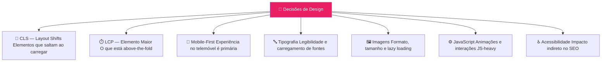
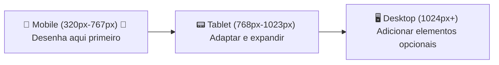
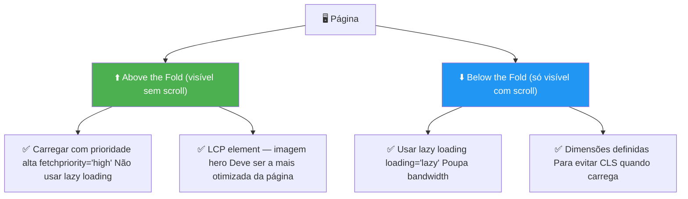

# Guia para Designers

> [!abstract] **O design e o SEO estão ligados**
> Decisões de design têm impacto direto no SEO, no Core Web Vitals e na acessibilidade para as IAs. Este guia cobre o que cada designer deve saber para criar experiências que tanto os utilizadores como o Google e as IAs adoram.

---

## Decisões de Design com Impacto em SEO



---

## 1. CLS — Cumulative Layout Shift

> [!warning] **O inimigo número 1 do design para SEO**
> O CLS acontece quando elementos da página saltam depois do carregamento inicial. É frustrante para o utilizador E penaliza o ranking.

### Causas comuns e soluções

| Causa do CLS | O que o designer deve fazer |
|-------------|---------------------------|
| **Imagens sem dimensões** | Sempre definir `width` e `height` no HTML |
| **Banners e ads dinâmicos** | Reservar espaço fixo para cada banner (placeholder) |
| **Web fonts carregadas tarde** | `font-display: swap` + preload das fontes |
| **Conteúdo injetado por JS** | Reservar espaço para elementos dinâmicos |
| **Carrossel de imagens** | Dimensões fixas no container do carrossel |

### Checklist CLS

- [ ] Todas as imagens têm width e height definidos
- [ ] Banners têm container de tamanho fixo
- [ ] Fontes usam `font-display: swap`
- [ ] Carrosséis têm dimensões fixas
- [ ] Nenhum elemento salta ao carregar

---

## 2. Design Mobile-First

> [!important] **Google indexa apenas a versão mobile**
> Desenha SEMPRE para mobile primeiro. O desktop é o "tamanho maior" do mobile, não o contrário.

### Hierarquia de Design Mobile



### O que o Google avalia no mobile

| Elemento | Standard recomendado |
|----------|---------------------|
| **Área de toque mínima** | 48px × 48px para botões e links |
| **Espaçamento entre links** | Mínimo 8px entre áreas clicáveis |
| **Tamanho de fonte** | Mínimo 16px para texto corrido |
| **Viewport** | `<meta name="viewport" content="width=device-width, initial-scale=1">` |
| **Conteúdo não oculto** | Não esconder conteúdo importante no mobile |
| **Velocidade** | < 3 segundos para carregamento completo |

---

## 3. Imagens — Decisões Críticas

### Formato correto por caso de uso

| Tipo de imagem | Formato recomendado | Porquê |
|---------------|--------------------|----|
| Fotografias | WebP (com fallback JPEG) | -30% tamanho vs JPEG |
| Imagens de alta qualidade | AVIF (com fallback WebP) | -50% tamanho vs JPEG |
| Ícones e ilustrações simples | SVG | Vetorial, escalável, texto-base |
| Logos | SVG | Nitidez em qualquer resolução |
| Transparência necessária | WebP ou PNG | Suporte a alpha channel |
| Screenshots com texto | PNG ou WebP | Melhor nitidez para texto |

### Above-the-fold vs Below-the-fold



---

## 4. Animações e Carrosséis

> [!danger] **Carrosséis são o elemento mais problemático do SEO**
> Carrosséis de imagens causam:
> - JavaScript pesado → pior INP
> - Imagens grandes → pior LCP
> - Layout shifts → pior CLS
> - Conteúdo em slides não visíveis = pode ser ignorado pelo Google

### Alternativas a carrosséis

| Em vez de carrossel | Usar isto |
|--------------------|-----------|
| Carrossel de produtos | Grid estático com hover effect |
| Carrossel de testemunhos | Secção estática com 3 testemunhos visíveis |
| Carrossel de imagens do portfolio | Masonry grid ou lightbox |
| Slider hero | Imagem hero estática (muito mais rápida) |

### Se mesmo assim precisar de carrossel

- Limitar a máximo 3-4 slides
- Lazy loading nos slides não iniciais
- Dimensões fixas no container
- JavaScript otimizado (Swiper.js é uma boa opção)
- Conteúdo crítico nunca em slide oculto

---

## 5. Tipografia e Web Fonts

### Impacto no SEO e CLS

| Prática | Impacto |
|---------|---------|
| Google Fonts hosted externamente | Pedido DNS extra, CLS se lento |
| Hospedar fontes localmente | Mais rápido, sem CLS de terceiros |
| `font-display: swap` | Texto visível imediatamente, swap quando a fonte carrega |
| Muito variedade de fontes | Pedidos extra, lentidão |
| Font fallback bem escolhido | Minimiza o salto visual no swap |

### Configuração recomendada

```css
/* Self-hosted com font-display: swap */
@font-face {
  font-family: 'Minha Fonte';
  src: url('/fonts/minha-fonte.woff2') format('woff2');
  font-display: swap;
}
```

---

## 6. Hierarquia Visual e SEO

Os motores de pesquisa e as IAs "lêem" a hierarquia visual através do código HTML. O design deve **reforçar** a hierarquia semântica, não contradizê-la.

### Alinhamento design ↔ SEO

| Elemento de Design | Deve corresponder a... |
|-------------------|----------------------|
| Elemento maior e mais proeminente | H1 da página |
| Secções visualmente distintas | H2 do conteúdo |
| Sub-secções ou blocos menores | H3 do conteúdo |
| Botão ou link principal | CTA primário |
| Breadcrumb visual | Breadcrumb no HTML + Schema |

---

## Checklist do Designer — SEO

### Mobile
- [ ] Design criado mobile-first
- [ ] Áreas de toque mínimo 48px
- [ ] Texto mínimo 16px
- [ ] Sem conteúdo oculto exclusivo do mobile que o Google veja no desktop

### Performance
- [ ] Todas as imagens em WebP/AVIF
- [ ] Dimensões width/height definidas em todas as imagens
- [ ] Hero image sem lazy loading
- [ ] Fontes auto-hospedadas com font-display: swap
- [ ] Carrosséis evitados ou minimizados

### CLS
- [ ] Espaço reservado para banners e ads
- [ ] Nenhum elemento que salte ao carregar
- [ ] Containers de carrossel com tamanho fixo

### Hierarquia
- [ ] H1 visualmente mais proeminente
- [ ] Hierarquia de headings refletida no design
- [ ] Breadcrumb visual presente nas subpáginas

---

## Ver também

- [[../02 - SEO/Performance Técnica|Performance Técnica]] — Core Web Vitals em detalhe
- [[../02 - SEO/Arquitetura e Estrutura da Página|Arquitetura e Estrutura]] — hierarquia de headings
- [[../02 - SEO/SEO Técnico|SEO Técnico]] — visão geral técnica
