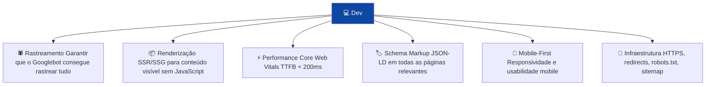

# Guia para Devs

> [!abstract] **O dev é o primeiro responsável pelo SEO técnico**
> Um site tecnicamente sólido é a fundação de qualquer estratégia SEO/GEO/AIO. Este guia cobre o que cada dev precisa de implementar e verificar.

---

## Responsabilidades do Dev em SEO



---

## 1. Renderização — A Decisão Mais Crítica

### Comparação de estratégias de renderização

| Estratégia | Como o Google lê | SEO | Performance | Quando usar |
|-----------|-----------------|-----|-------------|-------------|
| **CSR** (Client-Side Rendering) | Dois passes, pode falhar | ❌ Mau | Variável | Nunca para conteúdo crítico |
| **SSR** (Server-Side Rendering) | HTML completo no primeiro pedido | ✅ Excelente | Bom | Conteúdo dinâmico e personalizado |
| **SSG** (Static Site Generation) | HTML pré-gerado | ✅ Excelente | Excelente | Conteúdo estático ou pouco dinâmico |
| **ISR** (Incremental Static Regen.) | HTML pré-gerado com revalidação | ✅ Excelente | Excelente | Conteúdo que muda com alguma frequência |

### Regra de ouro

> [!important] **Todo o conteúdo indexável deve ser visível no HTML inicial**
> Se o conteúdo só aparece após JavaScript executar, o Googlebot pode não o ver. Usa SSR ou SSG para todo o conteúdo crítico.

```javascript
// ❌ CSR puro — Googlebot não vê o conteúdo
useEffect(() => {
  fetch('/api/content').then(data => setContent(data));
}, []);

// ✅ SSR — Next.js exemplo
export async function getServerSideProps() {
  const content = await fetchContent();
  return { props: { content } };
}

// ✅ SSG — Next.js exemplo
export async function getStaticProps() {
  const content = await fetchContent();
  return { props: { content }, revalidate: 3600 }; // ISR: revalida a cada hora
}
```

---

## 2. Performance — Core Web Vitals

### TTFB — Otimizar o servidor

```javascript
// ❌ Sem cache — gera HTML em cada pedido
app.get('/page', async (req, res) => {
  const data = await heavyDatabaseQuery(); // demora 500ms
  res.render('page', data);
});

// ✅ Com cache — serve HTML cacheado
app.get('/page', cache('5 minutes'), async (req, res) => {
  const data = await heavyDatabaseQuery();
  res.render('page', data);
});
```

### LCP — Otimizar o elemento principal

```html
<!-- ❌ Hero image com lazy loading — atrasa o LCP -->


<!-- ✅ Hero image com prioridade alta -->


<!-- ✅ Preload do LCP element no <head> -->
<link rel="preload" as="image" href="hero.webp" fetchpriority="high">
```

### CLS — Dimensões sempre definidas

```html
<!-- ❌ Sem dimensões — causa CLS -->


<!-- ✅ Com dimensões — sem CLS -->


<!-- ✅ CSS alternativo com aspect-ratio -->
<style>
.img-container {
  aspect-ratio: 4 / 3;
  width: 100%;
}
</style>
```

### Otimização de JavaScript

```html
<!-- ❌ Bloqueia o rendering -->
<script src="analytics.js"></script>

<!-- ✅ Defer — não bloqueia, executa em ordem -->
<script src="main.js" defer></script>

<!-- ✅ Async — não bloqueia, executa quando pronto -->
<script src="analytics.js" async></script>

<!-- ✅ Para módulos ES -->
<script type="module" src="app.js"></script>
```

---

## 3. Schema Markup — Implementação

### Onde colocar o JSON-LD

```html
<!DOCTYPE html>
<html>
<head>
  <!-- Schema no <head> -->
  <script type="application/ld+json">
    {
      "@context": "https://schema.org",
      "@type": "Organization",
      ...
    }
  </script>
  
  <!-- Múltiplos schemas na mesma página -->
  <script type="application/ld+json">
    {
      "@context": "https://schema.org",
      "@type": "BreadcrumbList",
      ...
    }
  </script>
</head>
```

### Schema dinâmico em Next.js

```javascript
// components/SchemaOrg.tsx
const SchemaOrg = ({ schema }) => (
  <script
    type="application/ld+json"
    dangerouslySetInnerHTML={{ __html: JSON.stringify(schema) }}
  />
);

// pages/blog/[slug].tsx
export default function BlogPost({ post }) {
  const schema = {
    "@context": "https://schema.org",
    "@type": "BlogPosting",
    "headline": post.title,
    "datePublished": post.publishedAt,
    "author": {
      "@type": "Person",
      "name": post.author.name
    }
  };
  
  return (
    <>
      <SchemaOrg schema={schema} />
      {/* ... */}
    </>
  );
}
```

---

## 4. Robots.txt e Sitemap

### robots.txt — estrutura recomendada

```
# robots.txt — colocar em /robots.txt

User-agent: *
# Bloquear areas admin
Disallow: /admin/
Disallow: /wp-admin/
Disallow: /wp-login.php

# Bloquear URLs com parâmetros problemáticos
Disallow: /*?*sort=
Disallow: /*?*page=
Disallow: /*?*utm_source=

# Bloquear checkout e conta
Disallow: /checkout/
Disallow: /minha-conta/
Disallow: /carrinho/

# NÃO bloquear CSS e JS (crítico!)
# Allow: /wp-content/themes/
# Allow: /wp-content/plugins/

Sitemap: https://seusite.pt/sitemap.xml
```

### Sitemap dinâmico em Next.js

```javascript
// pages/sitemap.xml.js
const Sitemap = () => null;

export async function getServerSideProps({ res }) {
  const pages = await getAllPages();
  const posts = await getAllPosts();
  
  const sitemap = `<?xml version="1.0" encoding="UTF-8"?>
<urlset xmlns="http://www.sitemaps.org/schemas/sitemap/0.9">
  ${pages.map(page => `
    <url>
      <loc>https://seusite.pt${page.slug}</loc>
      <lastmod>${page.updatedAt}</lastmod>
      <changefreq>monthly</changefreq>
      <priority>0.8</priority>
    </url>
  `).join('')}
  ${posts.map(post => `
    <url>
      <loc>https://seusite.pt/blog/${post.slug}</loc>
      <lastmod>${post.updatedAt}</lastmod>
      <changefreq>weekly</changefreq>
      <priority>0.6</priority>
    </url>
  `).join('')}
</urlset>`;

  res.setHeader('Content-Type', 'text/xml');
  res.write(sitemap);
  res.end();
  
  return { props: {} };
}

export default Sitemap;
```

---

## 5. Headers HTTP e Meta Tags

### Canonical tag

```html
<!-- Sempre definir canonical para evitar duplicados -->
<link rel="canonical" href="https://seusite.pt/pagina-principal">

<!-- Em Next.js com next/head -->
import Head from 'next/head';
<Head>
  <link rel="canonical" href={canonicalUrl} />
</Head>
```

### Meta robots controlados

```html
<!-- Páginas para indexar (padrão) -->
<meta name="robots" content="index, follow">

<!-- Páginas para NÃO indexar -->
<meta name="robots" content="noindex, nofollow">

<!-- Páginas importantes com nofollow nos links -->
<meta name="robots" content="index, nofollow">
```

### Open Graph e Twitter Cards

```html
<!-- Open Graph (Facebook, LinkedIn) -->
<meta property="og:title" content="Título da página">
<meta property="og:description" content="Descrição com 150-160 chars">
<meta property="og:image" content="https://seusite.pt/og-image.jpg">
<meta property="og:url" content="https://seusite.pt/pagina">
<meta property="og:type" content="article">

<!-- Twitter Card -->
<meta name="twitter:card" content="summary_large_image">
<meta name="twitter:title" content="Título da página">
<meta name="twitter:description" content="Descrição">
<meta name="twitter:image" content="https://seusite.pt/twitter-image.jpg">
```

---

## 6. Redirects e URLs

```javascript
// next.config.js — redirects 301

module.exports = {
  async redirects() {
    return [
      // URL antiga → URL nova (301 permanente)
      {
        source: '/antigo-caminho',
        destination: '/novo-caminho',
        permanent: true, // 301
      },
      // Redirect temporário (302) — usar com cuidado
      {
        source: '/promo',
        destination: '/promocoes',
        permanent: false, // 302
      },
    ];
  },
};
```

> [!warning] **Regra dos redirects**
> - Usar **301** para URLs que mudaram permanentemente (URL slug alterado, reestruturação)
> - Usar **302** apenas para redirects temporários (campanhas, A/B tests)
> - Nunca ter cadeias de redirects: A→B→C→D (encurtar para A→D)
> - Redirects para a mesma página = loop → erro crítico

---

## Checklist do Dev

### Renderização
- [ ] Conteúdo crítico visível sem JavaScript
- [ ] SSR ou SSG implementado
- [ ] Sem erros de hidratação

### Performance
- [ ] TTFB < 200ms (medir com WebPageTest)
- [ ] LCP < 2.5s (PageSpeed Insights)
- [ ] CLS < 0.1
- [ ] Hero image com fetchpriority="high"
- [ ] JavaScript não-crítico com defer/async

### Infraestrutura
- [ ] HTTPS ativo com certificado válido
- [ ] www e não-www redirecionam para versão canónica
- [ ] robots.txt correto (CSS/JS não bloqueados)
- [ ] Sitemap.xml submetido no GSC e Bing WMT
- [ ] Redirects 301 para URLs antigas

### Schema
- [ ] Organization em todas as páginas
- [ ] BreadcrumbList nas subpáginas
- [ ] BlogPosting em artigos
- [ ] FAQPage nas páginas com FAQ
- [ ] Validado no Rich Results Test

---

## Ver também

- [[../02 - SEO/Performance Técnica|Performance Técnica]] — Core Web Vitals em detalhe
- [[../02 - SEO/SEO Técnico|SEO Técnico]] — visão geral técnica
- [[../02 - SEO/Robots e Sitemap|Robots e Sitemap]] — configurações em detalhe
- [[../05 - Dados Estruturados/Schema Markup - Tipos e Implementação|Schema Markup]] — todos os schemas
