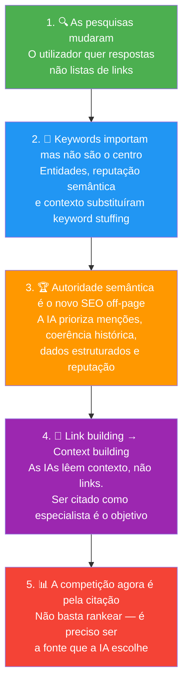
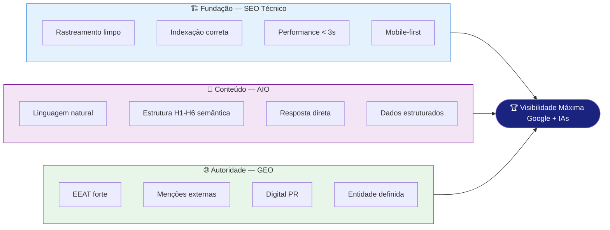
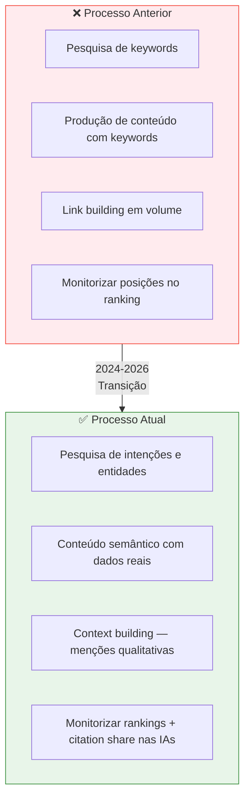
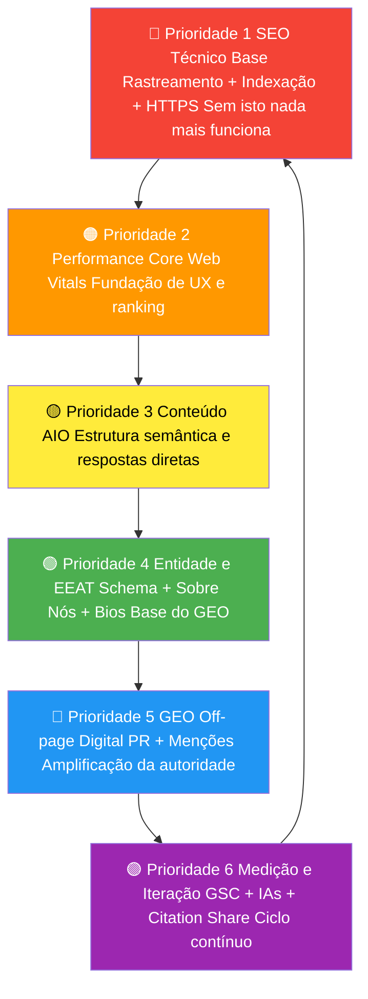

# Conclusões e Síntese Final

> [!abstract] **O que ficou para trás e o que está à frente**
> Esta documentação preparou-te para navegar o ecossistema de visibilidade digital de 2026. O mundo da pesquisa mudou fundamentalmente — e estas páginas explicam como estar à frente dessa mudança.

---

## As 5 Grandes Conclusões

---

## A Nova Realidade em Números

| Métrica | Impacto |
|---------|---------|
| **65%** | Das pesquisas no Google terminam sem um clique (zero-click) |
| **3-4×** | Aumento das pesquisas conversacionais desde 2023 |
| **1 em 4** | Utilizadores adultos usam IAs como motor de pesquisa principal |
| **40%** | Do tráfego de notícias está a ser substituído por AI Overview |
| **Top 3** | Posições no Google têm maior probabilidade de ser citadas no AI Overview |

---

## A Síntese Visual do Ecossistema

---

## O Que Cada Função Deve Fazer Agora

### Copywriters
1. Reformular headings como perguntas reais
2. Colocar resposta direta no 1.º parágrafo
3. Incluir dados e experiências reais no conteúdo
4. Verificar alinhamento com intenção de pesquisa

### Designers
1. Auditar CLS em todos os projetos ativos
2. Garantir que carrosséis têm dimensões fixas
3. Migrar imagens para WebP
4. Verificar Mobile-first em todos os designs

### Devs
1. Implementar SSR/SSG nos projetos novos
2. Adicionar Schema Organization a todos os sites
3. Auditar robots.txt e sitemap
4. Medir Core Web Vitals no PageSpeed Insights

### Accounts
1. Testar presença do cliente nas 3 principais IAs
2. Preparar dados para construir EEAT do cliente
3. Iniciar pipeline de Digital PR
4. Atualizar relatórios para incluir métricas GEO

---

## O Que Muda no Processo da Agência

---

## Framework de Priorização

Ao iniciar qualquer projeto de SEO/GEO/AIO, seguir esta ordem:

---

## O Mantra da Equipa

> [!tip] **Para recordar sempre**
>
> **Para o Google:** Cria conteúdo tecnicamente sólido, rápido e relevante.
>
> **Para a IA entender:** Estrutura como perguntas, responde diretamente, usa linguagem natural.
>
> **Para a IA citar:** Constrói autoridade real — dados originais, menções externas, EEAT forte.
>
> **O objetivo final:** Ser a fonte em que tanto o utilizador como a máquina confiam.

---

## Referências e Leitura Adicional

| Recurso | Para quê | Atualização |
|---------|---------|-------------|
| Google Search Central | Documentação oficial de SEO | Contínua |
| Google Search Console Help | Guias do GSC | Contínua |
| schema.org | Referência completa de schemas | Contínua |
| Google Quality Rater Guidelines | Entender o E-E-A-T em profundidade | Anual |
| Moz Blog | SEO e link building | Semanal |
| Ahrefs Blog | SEO técnico e data-driven | Semanal |
| Search Engine Journal | Notícias SEO e IA | Diário |

---

## Links da Wiki

- [[../00 - Home|🏠 Voltar ao Home]]
- [[../01 - Fundamentos/O que é SEO, GEO e AIO|📖 O que é SEO, GEO e AIO]]
- [[../02 - SEO/SEO - Overview|🔵 SEO Overview]]
- [[../03 - AIO/Como uma LLM Funciona|🟣 Como uma LLM Funciona]]
- [[../04 - GEO/GEO - Overview|🟢 GEO Overview]]
- [[../07 - Guias por Função/Guia para Copywriters|✍️ Guia para Copywriters]]
- [[../07 - Guias por Função/Guia para Designers|🎨 Guia para Designers]]
- [[../07 - Guias por Função/Guia para Devs|💻 Guia para Devs]]
- [[../07 - Guias por Função/Guia para Accounts|👔 Guia para Accounts]]
